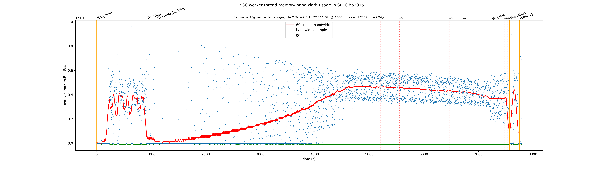

# ZGC Memory Bandwidth Monitoring

This is a patch to ZGC that enables sampling the memory bandwidth usage of 
garbage collector threads. It uses the `resctrl` kernel module to access the 
necessary performance counters exposed by Intel(R) RDT (MBM). Samples are 
logged with the tag `gc+zbw+stats`.

Prerequisites:
* Compatible Xeon CPU (Tested on 2nd generation Xeon Scalable, see intel-cmt-cat for a full list)
* `resctrl` kernel module `rdt=mbmtotal`
* Must be run as root

